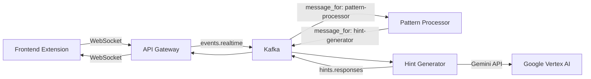

# ☁️ LeetCode Mentor - Backend

The backend powers the intelligence of LeetCode Mentor. It uses an **Event-Driven Architecture** to process user actions real-time, analyze coding patterns, and generate high-quality hints using LLMs.

## 🏗 Architecture Overview

The system processes events in a pipeline:



## 🧩 Microservices

| Service | Path | Description |
| :--- | :--- | :--- |
| **[API Gateway](./services/api-gateway)** | `/services/api-gateway` | The entry point. Manages persistent WebSocket connections with clients and handles the bi-directional flow of messages to/from Kafka. |
| **[Pattern Processor](./services/pattern-processor)** | `/services/pattern-processor` | The brain. Analyzes streams of events (typing speed, error rates, tab switches) to decide *when* intervention is needed. |
| **[Hint Generator](./services/hint-generator)** | `/services/hint-generator` | The voice. Constructs prompts for Google Gemini based on the context provided by the Pattern Processor and formats the response. |
| **[Chat Service](./services/chat-service)** | `/services/chat-service` | The conversation. Handles direct Q&A interaction with the user. |

## 🛠 Tech Stack

- **Language**: Python 3.11+
- **Framework**: FastAPI (Gateway), Custom Event Loop (Consumers)
- **Messaging**: Apache Kafka (Confluent Cloud)
- **AI/LLM**: Google Vertex AI (Gemini Pro)
- **Infrastructure**: Docker, Kubernetes (GKE)

## 🚀 Quick Start (Local)

### 1. Prerequisites
- Docker & Docker Compose
- Google Cloud credentials (JSON key)
- Confluent Cloud Kafka credentials

### 2. Environment Setup
Create a `.env` file in this directory based on `.env.example`.
```env
# Kafka Configuration
BOOTSTRAP_SERVERS=pkc-xxxx.us-central1.gcp.confluent.cloud:9092
SECURITY_PROTOCOL=SASL_SSL
SASL_MECHANISMS=PLAIN
SASL_USERNAME=your_key
SASL_PASSWORD=your_secret

# Google Cloud
GOOGLE_APPLICATION_CREDENTIALS=/app/vertex-ai-key.json
PROJECT_ID=your-project-id
LOCATION=us-central1
```

### 3. Run with Docker Compose
The easiest way to run the entire backend stack locally:

```bash
docker-compose up --build
```

This will start:
- API Gateway (Port 8000)
- Pattern Processor
- Hint Generator
- Chat Service

## 🔍 Event Schemas

We use a strict event schema to ensure consistency.

**Core Event Types:**
- `CODE_CHANGE`: Triggered when diff > 3 lines.
- `TEST_RUN`: Triggered when user runs LeetCode tests.
- `HINT_REQUEST`: Explicit user request for help.
- `TAB_SWITCH`: User leaves the tab (sign of struggle?).
- `GIVE_UP`: User requests the solution.

## 📂 Directory Structure

```text
backend/
├── services/           # Microservices source code
├── shared/            # Shared libraries (Kafka producers, schemas)
├── deployment/        # Kubernetes manifests & scripts
├── docker-compose.yml # Local development orchestration
└── requirements.txt   # Top-level deps
```